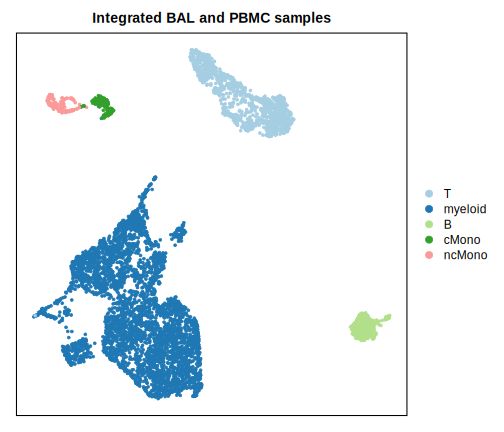

# Sutherland project \| BAL PBMC dataset

## Preprocessing workflow

Each sample underwent ambient RNA correction (SoupX), red blood cell filtering (HBA1, HBA2, HBB greater than 5% of total counts), damaged cell filtering (DamageDetective, v2.0.1), and doublet removal (DoubletFinder). Counts were scaled and normalised before integration using canonical correlation analysis on the top 30 principal components and 2000 most variable genes (Seurat).

## Sample information

**Table** Sample summary statistics following pre-processing

| Sample ID | BAL Cell Number | PBMC Cell Number |
|:----------|:----------------|:-----------------|
| ID_1098   | 667             | 575              |
| ID_1376   | 1491 \*         | 530              |
| ID_1483   | 731 \*          | 66               |
| ID_1484   | \-              | 260              |
| ID_1523   | 203             | 203              |
| ID_1566   | 791 \*          | 209              |
| ID_1676   | 250 \*          | 86               |

> Note: BAL samples showed unusual clustering patterns in samples [BAL_1376](), [BAL_1483](), and [BAL_1566]() as well as to a small extent in [BAL_1676](). This is typical of low quality, apparent upon comparison to high quality samples, [BAL_1098]() and [BAL_1523]().
>
> All PBMC samples were of a high quality, seen here [PBMC_1098](), [PBMC_1376](), [PBMC_1483](), [PBMC_1484](), [PBMC_1523](), [PBMC_1566](), and [PBMC_1676]().

## Visualisations

The integrated dataset is shown below across all samples coloured according to cell types.

**Lymphoid cells** formed clear clusters from PBMC samples that included T and B cells, with NK cells collecting with T cells. Myeloid population originating from PBMCs collected into a monocyte cluster made of distinct classical (cMono) and non-classical (ncMono) subsets. BAL samples contained predominantly myeloid cells, which, due to low sample quality, showed distinct [batch effects]() despite robust preprocessing. For this reason finer cell types such as macrophages or dendritic cells, while present, cannot be reliably annotated to a finer label than 'myeloid'.

## Composition

Cell composition varied across samples, some with a heavy myeloid composition and others with a heavy lymphoid population.

However, when viewing the tables isolated according to origin, this is seen to be more likely due to differences in BAL and PBMC proportions corresponding to samples. Samples having more BAL are rich in myeloid cells and those having more PBMCs are rich in lymphoid cells.

But even in accounting for sample origin, there is still relatively high dissimilarity in cell composition between samples. Though this may be due to low sample quality mentioned previously.

To explore this interactively, travel to the dashboard [here]().

#### Total cell compositions

**Table** Proportion of each cell type within samples of both BAL and PBMC origin

| Sample |    B    |    T    |  cMono  | myeloid | ncMono  |
|:------:|:-------:|:-------:|:-------:|:-------:|:-------:|
|  1098  | 0.01932 | 0.14654 | 0.01610 | 0.81562 | 0.00242 |
|  1376  | 0.01781 | 0.22365 | 0.00643 | 0.74320 | 0.00891 |
|  1483  | 0.03011 | 0.06148 | 0.00376 | 0.89962 | 0.00502 |
|  1484  | 0.21154 | 0.64615 | 0.03077 | 0.03077 | 0.08077 |
|  1523  | 0.19704 | 0.46305 | 0.17734 | 0.00493 | 0.15764 |
|  1566  | 0.06100 | 0.08200 | 0.03200 | 0.79400 | 0.03100 |
|  1676  | 0.13095 | 0.14583 | 0.00595 | 0.71726 | 0.00000 |

**Table** Actual cell numbers originating from each sample of both BAL and PBMC origin

| Sample  |   B | cMono | myeloid | ncMono |   T |
|:--------|----:|------:|--------:|-------:|----:|
| ID_1098 |  24 |    20 |    1013 |      3 | 182 |
| ID_1376 |  36 |    13 |    1502 |     18 | 452 |
| ID_1483 |  24 |     3 |     717 |      4 |  49 |
| ID_1484 |  55 |     8 |       8 |     21 | 168 |
| ID_1523 |  80 |    72 |       2 |     64 | 188 |
| ID_1566 |  61 |    32 |     794 |     31 |  82 |
| ID_1676 |  44 |     2 |     241 |      0 |  49 |

#### Isolated BAL and PBMC compositions

**Table** Cell compositions of BAL sample origin

| Sample  | B        | T        | myeloid  | cMono    | ncMono   |
|---------|----------|----------|----------|----------|----------|
| ID_1098 | 0.002998 | 0.097451 | 0.899550 |          |          |
| ID_1376 |          | 0.000000 | 1.000000 |          |          |
| ID_1483 | 0.001368 | 0.017784 | 0.980848 |          |          |
| ID_1523 | 0.197044 | 0.463054 | 0.004926 | 0.177340 | 0.157635 |
| ID_1566 | 0.001264 | 0.015171 | 0.983565 |          |          |
| ID_1676 |          | 0.036000 | 0.964000 |          |          |

**Table** Cell compositions of PBMC sample origin

| Sample  | B        | T        | myeloid  | cMono    | ncMono   |
|---------|----------|----------|----------|----------|----------|
| ID_1098 | 0.038261 | 0.203478 | 0.718261 | 0.034783 | 0.005217 |
| ID_1376 | 0.067925 | 0.852830 | 0.020755 | 0.024528 | 0.033962 |
| ID_1483 | 0.348485 | 0.545455 |          | 0.045455 | 0.060606 |
| ID_1484 | 0.211538 | 0.646154 | 0.030769 | 0.030769 | 0.080769 |
| ID_1523 | 0.197044 | 0.463054 | 0.004926 | 0.177340 | 0.157635 |
| ID_1566 | 0.287081 | 0.334928 | 0.076555 | 0.153110 | 0.148325 |
| ID_1676 | 0.511628 | 0.465116 |          | 0.023256 |          |

## References 

-   Young, M.D., Behjati, S. (2020). SoupX removes ambient RNA contamination from droplet-based single-cell RNA sequencing data, GigaScience, Volume 9, Issue 12, December 2020, giaa151bioRxiv, 303727, <https://doi.org/10.1093/gigascience/giaa151>

-   Hao, Y., Stuart, T., Kowalski, M., Choudhary, S., Hoffman, P., Hartman, A., Srivastava, A., Molla, G., Madad, S., Fernandez-Granda, C. & Satija, R. (2024) 'Dictionary learning for integrative, multimodal and massively scalable single-cell analysis', *Nature Biotechnology*, 42(2), pp. 293–304. doi:10.1038/s41587-023-01767-y.

-   McGinnis, C.S., Murrow, L.M. and Gartner, Z.J. (2019). DoubletFinder: Doublet detection in single-cell RNA sequencing data using artificial nearest neighbors. *Cell Systems*, 8(4), pp.329-337.e4. <https://doi.org/10.1016/j.cels.2019.03.003>

Note this workflow made use of the DamageDetective R package we are in the process of writing up that is available on [GitHub](https://github.com/AlicenJoyHenning/DamageDetective) and [CRAN](<https://cloud.r-project.org/web/packages/DamageDetective/index.html>).
