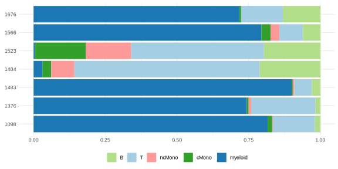
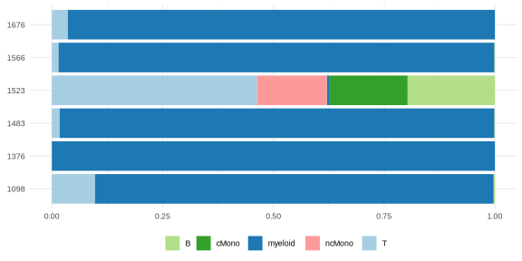
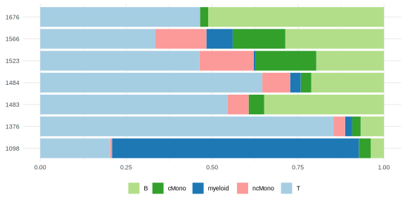

# Sutherland project \| BAL PBMC dataset

## Preprocessing workflow

Each sample underwent ambient RNA correction (SoupX), red blood cell filtering (HBA1, HBA2, HBB greater than 5% of total counts), damaged cell filtering (DamageDetective, v2.0.1), and doublet removal (DoubletFinder). Counts were scaled and normalised before integration using canonical correlation analysis on the top 30 principal components and 2000 most variable genes (Seurat).

## Sample information

**Table** Sample summary statistics following pre-processing

| Sample ID | BAL Cell Number | PBMC Cell Number |
|:----------|:----------------|:-----------------|
| ID_1098   | 667             | 575              |
| ID_1376   | 1491 \*         | 530              |
| ID_1483   | 731 \*          | 66               |
| ID_1484   | \-              | 260              |
| ID_1523   | 203             | 203              |
| ID_1566   | 791 \*          | 209              |
| ID_1676   | 250 \*          | 86               |

> Note: BAL samples showed unusual clustering patterns in samples \*[BAL_1376](https://github.com/AlicenJoyHenning/TB_BAL/blob/master/plots/sample_quality/BAL_1376.png), \*[BAL_1483](https://github.com/AlicenJoyHenning/TB_BAL/blob/master/plots/sample_quality/BAL_1483.png), \*[BAL_1566](https://github.com/AlicenJoyHenning/TB_BAL/blob/master/plots/sample_quality/BAL_1566.png) and, to a small extent, \*[BAL_1676](https://github.com/AlicenJoyHenning/TB_BAL/blob/master/plots/sample_quality/BAL_1676.png). This is typical of low quality samples. This is clear when comparing the clustering to high quality samples, [BAL_1098](https://github.com/AlicenJoyHenning/TB_BAL/blob/master/plots/sample_quality/BAL_1098.png) and [BAL_1523](https://github.com/AlicenJoyHenning/TB_BAL/blob/master/plots/sample_quality/BAL_1523.png).
>
> All PBMC samples were of a high quality [PBMC_1098](https://github.com/AlicenJoyHenning/TB_BAL/blob/master/plots/sample_quality/PBMC_1098.png), [PBMC_1376](https://github.com/AlicenJoyHenning/TB_BAL/blob/master/plots/sample_quality/PBMC_1376.png), [PBMC_1483](https://github.com/AlicenJoyHenning/TB_BAL/blob/master/plots/sample_quality/PBMC_1483.png), [PBMC_1484](https://github.com/AlicenJoyHenning/TB_BAL/blob/master/plots/sample_quality/PBMC_1484.png), [PBMC_1523](https://github.com/AlicenJoyHenning/TB_BAL/blob/master/plots/sample_quality/PBMC_1523.png), [PBMC_1566](https://github.com/AlicenJoyHenning/TB_BAL/blob/master/plots/sample_quality/PBMC_1566.png), and [PBMC_1676](https://github.com/AlicenJoyHenning/TB_BAL/blob/master/plots/sample_quality/PBMC_1676.png).

## Visualisations

The integrated dataset is shown below across all samples coloured according to cell types.

**Lymphoid cells** formed clear clusters from PBMC samples that included T and B cells, with NK cells collecting with T cells. Myeloid populations originating from PBMCs are collected into a monocyte cluster made of distinct classical (cMono) and non-classical (ncMono) subsets. BAL samples contained predominantly myeloid cells, which, due to low sample quality, showed distinct [batch effects](https://github.com/AlicenJoyHenning/TB_BAL/blob/master/plots/integrated/batch_effect.png) despite robust preprocessing. For this reason, the myeloid clusters cannot be reliably annotated to finer labels, such as into macrophages or dendritic cells, despite it being likely that they are present.

## Composition

Cell composition varied across samples, some with a heavy myeloid composition and others with a heavy lymphoid population. However, when viewing the compositions according to tissue origin, we see this is most likely due to differences in BAL and PBMC proportions of the corresponding samples.

In general, samples of BAL origin are rich in myeloid cells while PBMCs are rich in lymphoid cells. But even in accounting for sample origin, there is dissimilarity in cell composition between samples.

#### Total cell compositions

**Figure** Proportion of each cell type within samples of both BAL and PBMC origin

**Table** Actual cell numbers originating from each sample of both BAL and PBMC origin

| Sample  |   B | cMono | myeloid | ncMono |   T |
|:--------|----:|------:|--------:|-------:|----:|
| ID_1098 |  24 |    20 |    1013 |      3 | 182 |
| ID_1376 |  36 |    13 |    1502 |     18 | 452 |
| ID_1483 |  24 |     3 |     717 |      4 |  49 |
| ID_1484 |  55 |     8 |       8 |     21 | 168 |
| ID_1523 |  80 |    72 |       2 |     64 | 188 |
| ID_1566 |  61 |    32 |     794 |     31 |  82 |
| ID_1676 |  44 |     2 |     241 |      0 |  49 |

#### Isolated BAL and PBMC compositions

**BAL**

**Figure** Cell compositions of BAL sample origin

**Table** Actual cell numbers for BAL sample origin

| Sample  |  B  |  T  | cMono | ncMono | myeloid |
|:-------:|:---:|:---:|:-----:|:------:|:-------:|
| ID_1098 |  2  | 65  |  NA   |   NA   |   600   |
| ID_1376 | NA  | NA  |  NA   |   NA   |  1491   |
| ID_1483 |  1  | 13  |  NA   |   NA   |   717   |
| ID_1523 | 40  | 94  |  36   |   32   |    1    |
| ID_1566 |  1  | 12  |  NA   |   NA   |   778   |
| ID_1676 | NA  |  9  |  NA   |   NA   |   241   |

**PBMC**

**Figure** Cell compositions of PBMC sample origin

**Table** Actual cell numbers for PBMC sample origin

| Sample  |  B  |  T  | cMono | ncMono | myeloid |
|:-------:|:---:|:---:|:-----:|:------:|:-------:|
| ID_1098 | 22  | 117 |  20   |   3    |   413   |
| ID_1376 | 36  | 452 |  13   |   18   |   11    |
| ID_1483 | 23  | 36  |   3   |   4    |   NA    |
| ID_1484 | 55  | 168 |   8   |   21   |    8    |
| ID_1523 | 40  | 94  |  36   |   32   |    1    |
| ID_1566 | 60  | 70  |  32   |   31   |   16    |
| ID_1676 | 44  | 40  |   2   |   NA   |   NA    |

## References

-   Young, M.D., Behjati, S. (2020). SoupX removes ambient RNA contamination from droplet-based single-cell RNA sequencing data, GigaScience, Volume 9, Issue 12, December 2020, giaa151bioRxiv, 303727, <https://doi.org/10.1093/gigascience/giaa151>

-   Hao, Y., Stuart, T., Kowalski, M., Choudhary, S., Hoffman, P., Hartman, A., Srivastava, A., Molla, G., Madad, S., Fernandez-Granda, C. & Satija, R. (2024) 'Dictionary learning for integrative, multimodal and massively scalable single-cell analysis', *Nature Biotechnology*, 42(2), pp. 293–304. <doi:10.1038/s41587-023-01767-y>.

-   McGinnis, C.S., Murrow, L.M. and Gartner, Z.J. (2019). DoubletFinder: Doublet detection in single-cell RNA sequencing data using artificial nearest neighbors. *Cell Systems*, 8(4), pp.329-337.e4. <https://doi.org/10.1016/j.cels.2019.03.003>

Note this workflow made use of the DamageDetective R package we are in the process of writing up that is available on [GitHub](https://github.com/AlicenJoyHenning/DamageDetective) and [CRAN](https://cloud.r-project.org/web/packages/DamageDetective/index.html).
